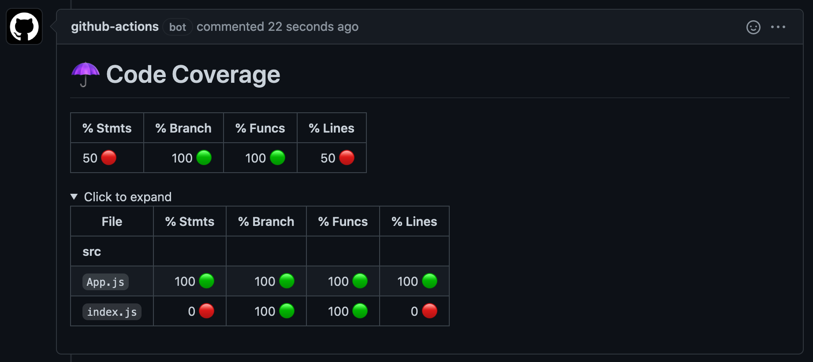
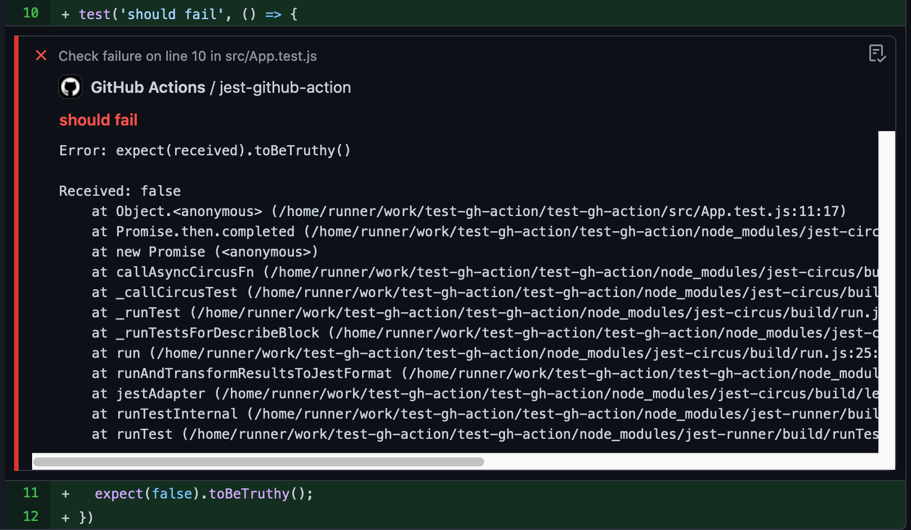
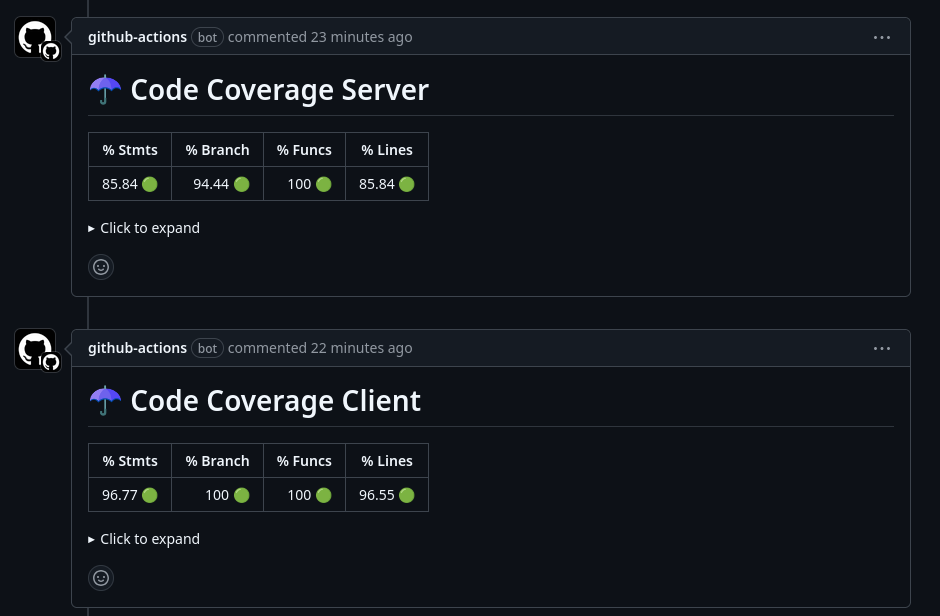

# Jest Github Action

Main features:

- Add status checks with code annotations to your pull requests
- Comment your pull requests with code coverage table (if tests succeeded)
- If you use multiple jest results files, you can specify which one to use
- You can add a custom name to the PR comment and actions job

## Coverage example




## Check annotations example



## Check annotations example



## Usage


```yaml
uses: Pouish85/jest-github-action
env:
  GITHUB_TOKEN: ${{ secrets.GITHUB_TOKEN }}
```

### Overriding the test command

By default, this action will execute `npm test` to run your tests.
You can change this behavior by providing a custom `test-command` like this:

```yaml
uses: Pouish85/jest-github-action
env:
  GITHUB_TOKEN: ${{ secrets.GITHUB_TOKEN }}
with:
  # this is just an example, this could be any command that will trigger jest
  test-command: "yarn test"
```

### Running tests only on changed files

```yaml
uses: Pouish85/jest-github-action
env:
  GITHUB_TOKEN: ${{ secrets.GITHUB_TOKEN }}
with:
  # Runs tests related to the changes since the base branch of your pull request
  # Default to false if not set
  changes-only: true
```

### Silencing the code coverage comment

```yaml
uses: Pouish85/jest-github-action
env:
  GITHUB_TOKEN: ${{ secrets.GITHUB_TOKEN }}
with:
  # To avoid reporting code coverage, set this variable to false
  coverage-comment: false
```

### Running tests in a subdirectory

For running tests in folders other than root, supply a working-directory.

```yaml
uses: Pouish85/jest-github-action
env:
  GITHUB_TOKEN: ${{ secrets.GITHUB_TOKEN }}
with:
  working-directory: "frontend"
```

### Specifying the jest results file

```yaml
uses: Pouish85/jest-github-action
env:
  GITHUB_TOKEN: ${{ secrets.GITHUB_TOKEN }}
with:
  file-name: your.file.name
```

### Adding a custom name to the PR comment and actions job

```yaml
uses: Pouish85/jest-github-action
env:
  GITHUB_TOKEN: ${{ secrets.GITHUB_TOKEN }}
with:
  test-name: "Your custom name"
```

## Credits

Thanks to [willcaul/jest-github-action](https://github.com/willcaul/jest-github-action), which this package is forked from, as well as [mattallty/jest-github-action](https://github.com/mattallty/jest-github-action) and [FirmNav/jest-code-coverage-commenter](https://github.com/FirmNav/jest-code-coverage-commenter), which was used as a reference for the coverage comment format.
